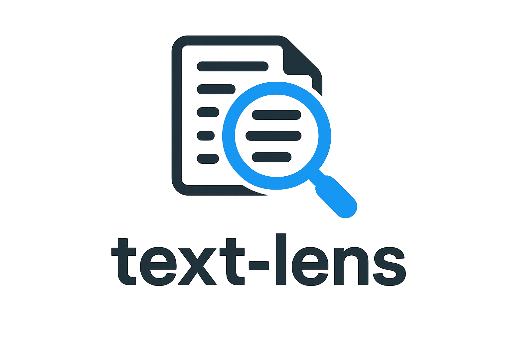

# text-lens
Turn any block of text into clear, insight-packed charts.

<p align="left">
  
</p>

## Demo

Watch a quick preview below (GIF)

### 🔹 Preview (GIF)


## Features

#### Core Features
- Text Analysis Engine: Analyzes word count, sentence count, unique words, and estimated reading time
- Interactive Text Input: Multi-line text box with scrollbar and right-click copy/paste menu
- Visual Data Charts: Generate bar charts, histograms, and pie charts from text data
- Advanced Statistics: Calculate reading level, complexity scores, lexical diversity and more...
- Dynamic Interface: Switches between input view and various visualization displays
- Clear Functionality: One-click clearing of both input and output areas

#### Visualization Features
- Top Words Chart: Horizontal bar chart showing 10 most frequent words in text
- Sentence Length Distribution: Histogram displaying words per sentence patterns
- Punctuation Breakdown: Pie chart analyzing usage of periods, commas, questions, exclamations
- Advanced Stats: In-depth metrics covering readability, vocabulary diversity, sentence patterns, word usage, and overall text complexity

## Installation

### Prerequisities
- Python 3.8 or higher

### Quick Start

1. **Clone the repository**
   ```bash
   git clone https://github.com/adrirubio/text-lens.git
   cd text-lens
   ```

2. **Install dependencies**
   ```bash
   pip install -r requirements.txt
   ```

3. **Run the application**
   ```bash
   python app.py
   ```
